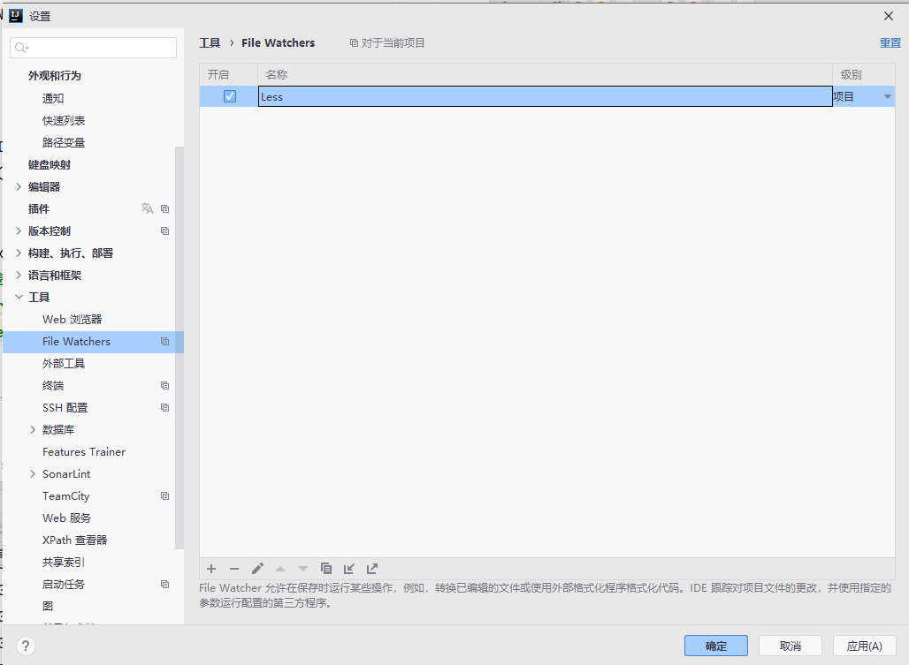

# Rider Typora Themes

[English Version](README_EN.md)

## 灵感来源

样式灵感来源于`JetBrains IntelliJ Platform`插件[Rider UI Theme Pack](https://plugins.jetbrains.com/plugin/13883-rider-ui-theme-pack)[^1].

## 介绍

推荐使用[JetBrains Mono](https://github.com/JetBrains/JetBrainsMono)字体.

### Less使用参考

> 默认使用`WebStorm`.

1. 安装[Node.js®](https://nodejs.org/zh-cn/).
2. 安装[Less.js](http://lesscss.org/).

```bash
npm i -g less
```

3. 设置`File Watchers`.

- 点击添加按钮,选择`Less`,无需额外配置,保存即可.



4. 安装完成后,即可自动编译.
5. `Less`文档见[Getting started | Less.js](http://lesscss.org/);


## 注意

> 此项目的`JetBrains`、`Rider`、`ReSharper`、`WebStorm`商标(“Trademarks”)是 [JetBrains](https://www.jetbrains.com/zh-cn) 的财产。
>
> 若进行二创(二次创作),请遵守[JetBrain商标使用指南](https://www.jetbrains.com/zh-cn/company/brand/)及[Apache License, Version 2.0](http://www.apache.org/licenses/LICENSE-2.0).

## License

>Copyright (C) 2021 Muii, Inc.
>
>Licensed under the Apache License, Version 2.0 (the "License");
>you may not use this file except in compliance with the License.
>You may obtain a copy of the License at
>
>http://www.apache.org/licenses/LICENSE-2.0
>
>Unless required by applicable law or agreed to in writing, software
>distributed under the License is distributed on an "AS IS" BASIS,
>WITHOUT WARRANTIES OR CONDITIONS OF ANY KIND, either express or implied.
>See the License for the specific language governing permissions and
>limitations under the License.

[^1]:https://github.com/JetBrains/rider-theme-pack

